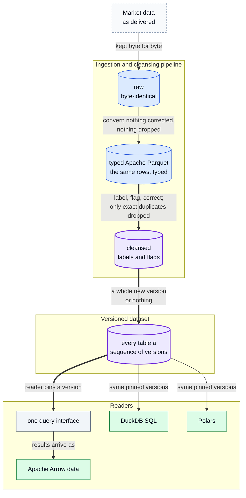
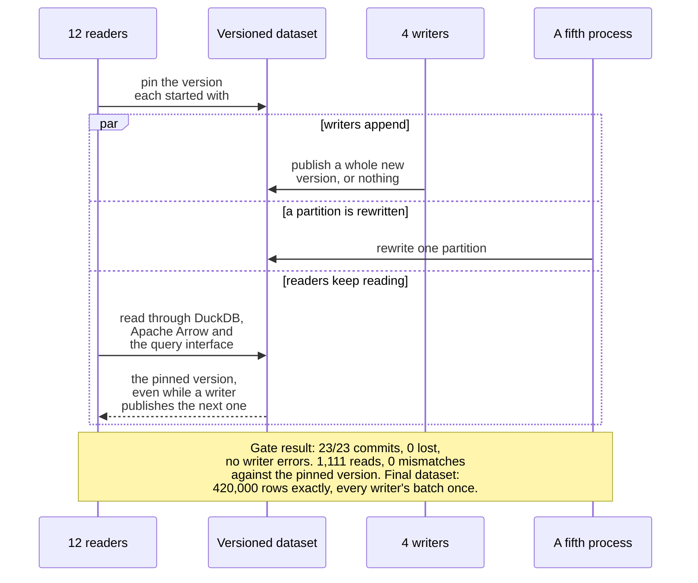

# CUHK QTS research data platform: 700B+ rows of tick data

[](https://github.com/oscar-chw/qts-platform-showcase/actions/workflows/ci.yml) [](https://github.com/oscar-chw/qts-platform-showcase/actions/workflows/lint.yml)

A university quant society's research team needed tick-level market data it could trust and query
in seconds. As the team's sole developer, Oscar Choi built the platform that serves it: an
ingestion and cleansing pipeline plus a versioned reader library over **700B+ rows** (A-share and
crypto, stored, as of 2026-10-05). Cleansing flags rows instead of dropping them, after a time
filter was found silently discarding **113,180** closing-auction trades in one day; the only rows
it removes are exact duplicates, **0.09%**.



Where in the code: closed source, not in this repository; each step is described in
[data-model.md](docs/data-model.md), and every diagram is indexed in [DIAGRAMS.md](docs/DIAGRAMS.md).

## Why this exists

The CUHK Quant Trading Society's researchers study A-share and crypto markets at tick level: every
trade, order and quote. Vendor deliveries arrive as compressed archives with their own quirks, and
the team had no full-time operator. Researchers needed three things the raw files could not give
them: data they could trust, queries that answer in seconds, and results they could reproduce
next month on exactly the same rows.

## Approach

- **Three layers.** Raw files are kept byte-identical. A typed Apache Parquet layer holds the same rows,
  typed, with nothing corrected and nothing dropped. A cleansed layer adds labels and flags and
  corrects values while keeping the vendor's original; it removes only exact duplicates.
- **Versioned, pinned datasets.** Writers publish a whole new version or nothing; readers pin the
  version they started with, and can name one to reproduce a result later.
- **One interface.** The same call works wherever a researcher works. Asking for
  something that is not there raises an error rather than returning an empty table, and gap fills
  that read the future need an explicit opt-in. Results arrive as Apache Arrow data, and DuckDB SQL
  or Polars can read the same pinned versions directly. Call shapes, with invented names:
  [data-model.md](docs/data-model.md#one-interface-wherever-a-researcher-works).
- **Gates.** A property holds when a script that checks it exits 0, and every gate must be able to
  fail.

How a publish and the readers meet, as the concurrency gate ran it ([results](docs/results.md#concurrency)):



Where in the code: closed source, not in this repository; the gate is described in
[reliability.md](docs/reliability.md#concurrency-tested-rather-than-argued).

### Design decisions and trade-offs

- **Flag, never drop.** Only exact duplicates are deleted; every other rule labels, flags or
  corrects a value, keeping the vendor's original, and is counted per day.
- **Three layers, not two.** The typed layer turns a cleansing-rule change from days of
  re-decoding archives into hours, and shows exactly what each rule touched.
- **Compression measured, not assumed.** The level was chosen by a rule written in advance:
  3.9% smaller, no slower to scan, 5.7× slower to write.
- **Profile before rewriting.** Caching the per-version file list made the slow query 3.7–5.2×
  faster, where a rewrite in a compiled language would have sped up work that did not need doing.
- **Safety over peak speed.** The interface is slower than hand-written DuckDB SQL, and DuckDB
  over the same files stays available.

Each decision in full, with what it cost: [data-model.md](docs/data-model.md#decisions-the-data-forced).

## Results

| Measure | Result | Label | Source |
|---|---|---|---|
| Stored market-data rows: A-share cleansed (565.9B) plus crypto stored (138.1B) | 700B+ | Live | table counts, 2026-10-05 |
| Closing-auction trades a time-window filter had silently dropped, one day | 113,180 | Test | data platform design, 2026-09-28 |
| A-share rows cleansing removed, all of them exact duplicates; every other rule labels, flags or corrects | 0.09% | Live | table counts, 2026-10-05 |
| Dataset commits on a small test dataset (420,000 rows) while 12 readers and 5 writers shared it | 23/23 commits, 0 lost | Test | concurrency gate results, 2026-09-23 |
| Whole-market day, warm: the query interface against hand-written DuckDB SQL | 1.49× slower | Test | data API benchmark, 2026-09-30 |

**Live**: read from the running platform. **Test**: a deliberate benchmark or gate. Speed is given
only as ratios; absolute timings are left out on purpose. Why 700B+ counts stored rows, not
distinct ones: [results.md](docs/results.md#scale).

Three data-reading steps, timed by a scripted walkthrough of a researcher's work before and after a
round of fixes, ran 14×–99× faster; the same record's other everyday steps improved about 1.4–1.5×, and one about 5×
([results.md](docs/results.md#researcher-steps-before-and-after)).

The interface is **slower** than hand-written DuckDB SQL: 1.95× on one symbol-day and 1.49× on a
whole-market day, and about 3.5× on a bar request left out of the comparison because the two do
different work. That cost buys pinned versions, explicit errors, session labels and look-ahead
refusal, and it is published on purpose. Every figure, with its caveats:
[results.md](docs/results.md).

## Quick start

```bash
bash scripts/demo.sh    # re-derives every computed figure in docs/results.md from its raw counts
bash scripts/check.sh   # adds the document checks (links, headline table, figures, terms) and their self-test
```

There is no platform code here to run: this is a write-up. To read it in under five minutes,
start with [results.md](docs/results.md). To run the ideas rather than read about them, see the
stand-in, [qts-platform-demo](https://github.com/oscar-chw/qts-platform-demo).

## Project structure

```text
docs/      the write-up: results, data model, reliability, diagrams
scripts/   check_docs.py (document checks), figures.py (recomputes results.md), demo.sh, check.sh
.github/   CI: the full check and a correctness-only lint
```

Docs: see [docs/README.md](docs/README.md).

## Limits

- **The platform's numbers are not reproducible from here.** Its source and data are closed; the
  numbers rest on dated private records, described in [results.md](docs/results.md#sources).
- **The stand-in is not the platform.** [qts-platform-demo](https://github.com/oscar-chw/qts-platform-demo)
  is an independent re-implementation written only from this write-up; it shares none of the
  platform's code, runs on SYNTHETIC data at toy scale, and shows the ideas and none of its numbers.
- **No uptime or SLA figure.** No availability measurement exists that would support one.
- **The crypto count is a snapshot, not final**, and its exact-duplicate count was not recorded,
  so the number of distinct rows behind 700B+ is unmeasured; a re-cleanse is in progress.
- **The query-fix ratios and the researcher-step ratios come from write-ups' tables** rather than
  raw per-run files, and the first query on a new nightly version, which rebuilds the cache, was not timed.
- **No researcher count or usage figure is reported**, because no dated record of one exists. The
  researcher-step ratios come from a scripted walkthrough of a researcher's steps, not from
  researchers.

## What I learned

1. **A setting found in a configuration file proves nothing until its effect is observed under
   load**: one such guarantee did nothing when it was finally measured. Source: decisions log,
   August 2026.
2. **The worst failures pass for health.** A check that passes against a stand-in for the thing it
   should be checking, a health check that answers OK without asking the service it describes, and
   an alerter that is quiet because it has stopped ([reliability.md](docs/reliability.md#failures-that-pass-for-health);
   source: handover document, 2026-09-07).
3. **A probe that runs out of time produces the same empty output as a broken system**, so how
   long the probe takes has to be known before its silence means anything. Source: decisions log,
   measurements of 2026-08-23.
4. **An unreliable checker does more harm than none, because its verdict gets trusted.** Hence
   checkers that carry self-tests and gates that refuse an empty run
   ([reliability.md](docs/reliability.md#a-claim-is-a-script-that-exits-0); source: decisions log,
   August 2026).

## Credits and licence

Oscar was the research team's sole developer: he set the requirements, designed the layers and
the gates, and reviewed every change. The code was written by AI coding agents under that design
and review; 815 of the 845 commits in the main repository carry an AI co-author trailer (count of
2026-10-03). This repository holds none of the platform's code, no infrastructure detail and no
data; every number cites a dated source document by title ([sources](docs/results.md#sources)).

Text and diagrams: CC BY 4.0. Code in scripts/: MIT. Both in [LICENSE](LICENSE).

Implemented with AI coding agents under Oscar's design and review.
