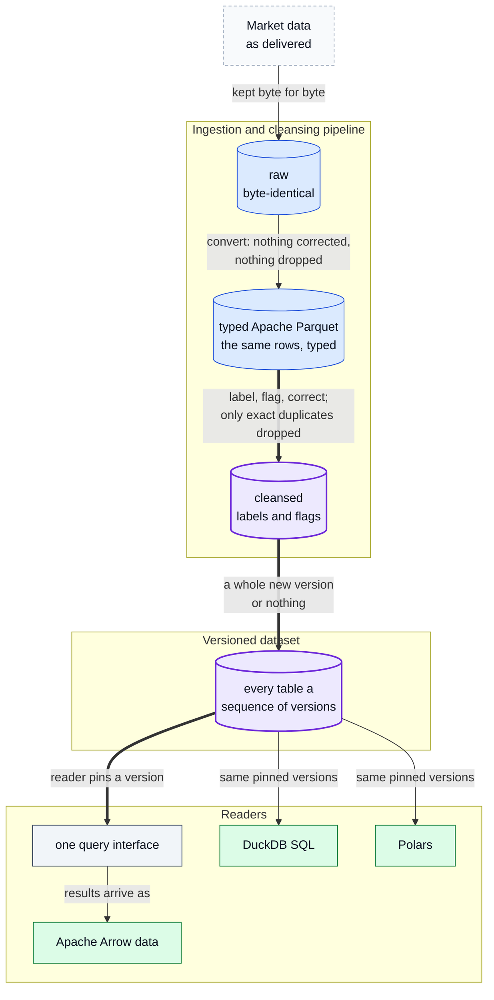
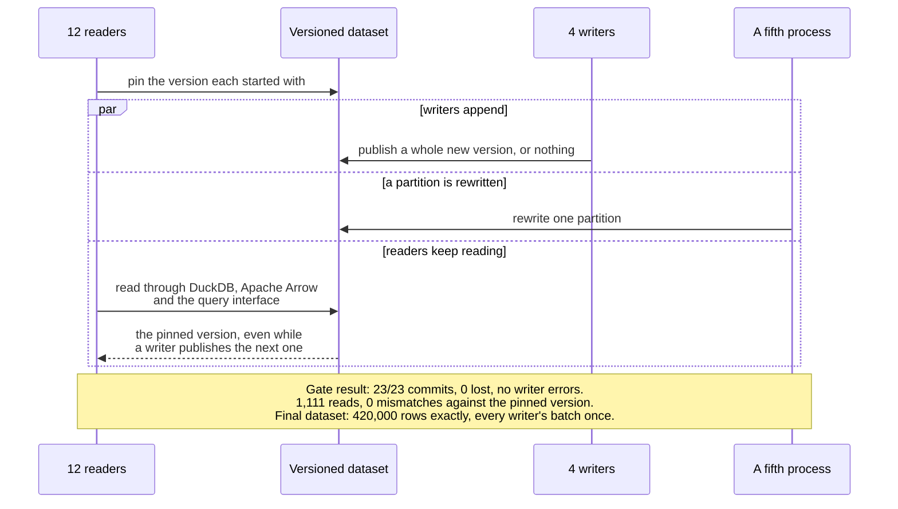
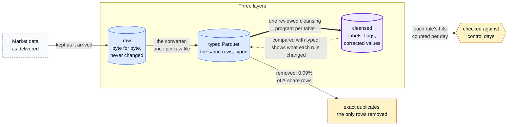
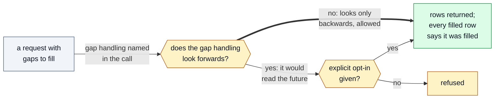
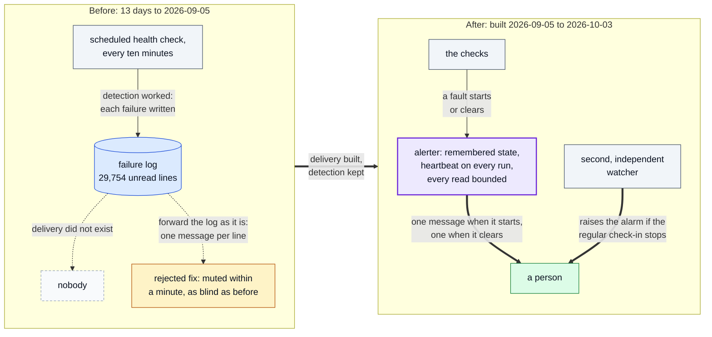

# Diagrams

Every diagram in this write-up, numbered. Each node is a layer, a step or a check the write-up
describes; the platform's code is closed, so each diagram names the page that describes it instead
of a path. If a diagram and the code disagree, the code wins.

1. [System overview](#1-system-overview)
2. [Versioned publish under concurrent readers and writers](#2-versioned-publish-under-concurrent-readers-and-writers)
3. [Three layers: what changes each one](#3-three-layers-what-changes-each-one)
4. [Look-ahead refusal](#4-look-ahead-refusal)
5. [The alerting incident: detection worked, delivery did not](#5-the-alerting-incident-detection-worked-delivery-did-not)

## 1. System overview

The layers a delivery passes through, the versioned dataset they are published to, and the readers that see it; the accented path is the one this write-up is about.

Where in the code: closed source, not in this repository; each step is described in [data-model.md](data-model.md).

## 2. Versioned publish under concurrent readers and writers

Writers publish a whole version or nothing while readers keep the version they pinned, as the concurrency gate exercised it ([results](results.md#concurrency)).

Where in the code: closed source, not in this repository; the gate is described in [reliability.md](reliability.md#concurrency-tested-rather-than-argued).

## 3. Three layers: what changes each one

What each layer holds, what is allowed to change it, and the one kind of row cleansing removes.

Where in the code: closed source, not in this repository; described in [data-model.md](data-model.md#three-layers).

## 4. Look-ahead refusal

Gap handling that looks only backwards is allowed; one that would read the future is refused unless the caller opts in.

Where in the code: closed source, not in this repository; described in [data-model.md](data-model.md#one-interface-wherever-a-researcher-works).

## 5. The alerting incident: detection worked, delivery did not

Before the fix, every failure was detected and written to a log nobody read; after it, a fault reaches a person once when it starts and once when it clears.

Where in the code: closed source, not in this repository; the incident is told in [reliability.md](reliability.md#incident-thirteen-days-of-failures-that-reached-nobody).
