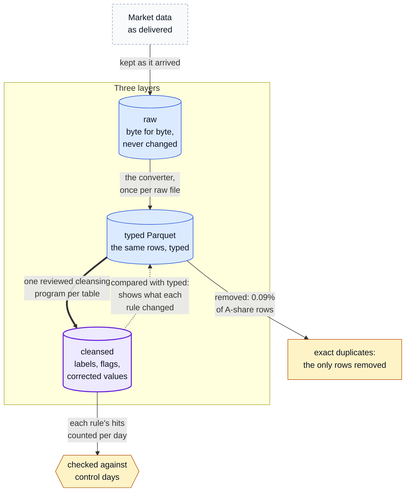
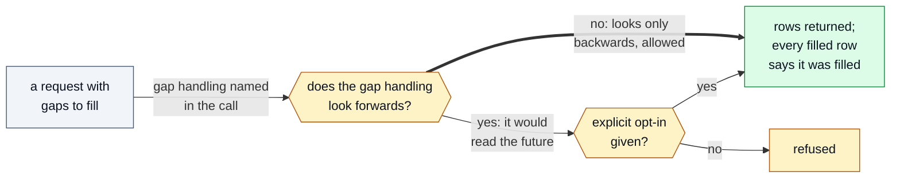

# The data model

What a researcher on the platform gets, described at the level of ideas. No code, internal names
or implementation detail is published; the function, argument and dataset names below are invented.
Numbers are sourced in [results.md](results.md).

What each layer holds and what is allowed to change it:



Where in the code: closed source, not in this repository; the layers are described below.

## Three layers

| Layer | What it holds | Changed by |
|---|---|---|
| raw | the files exactly as they arrived, byte for byte | nothing, ever |
| typed Parquet | the same rows with proper types, in Apache Parquet files; nothing corrected, nothing dropped | the converter, once per raw file |
| cleansed | the typed rows with labels and flags added: trading session by exchange and date, cancel events kept as events, each rule's hits counted per day | one reviewed cleansing program per table |

**Raw is kept byte-identical** so that any later layer can be rebuilt and any disagreement can be
settled against what the supplier actually sent.

**The typed layer adds nothing and removes nothing.** Because it is the supplier's rows, merely
typed, comparing it with the cleansed layer shows exactly what cleansing changed, rule by rule.

**The cleansed layer flags rather than drops.** The only rows ever removed are exact duplicates
(0.09% of A-share rows). Everything else a rule catches gets a label, a flag or a corrected value,
and a researcher who disagrees with a rule can still see the row.

## Versioned, pinned datasets

Every table is a sequence of versions. Each version lists every file it contains, with a size and
a checksum. A writer publishes a new version all at once or not at all; a reader pins the version
it started with and keeps reading that version even while a writer publishes the next one. A
researcher can name a version explicitly, so a backtest run today can be re-run on the same bytes
next month.

That is a claim the platform tested rather than argued: 12 readers and 5 writers on one small
test dataset gave 23/23 commits with none lost, and 1,111 reads with no mismatch against the version each had
pinned ([results](results.md#concurrency)).

## One interface, wherever a researcher works

Researchers make the same call wherever they work, and get the same rows; the interface is designed
so that every way of reaching the data returns the same rows.

Results arrive as Apache Arrow data, so any tool with an Arrow reader can use them without a copy.
Researchers who prefer SQL or dataframes point DuckDB or Polars at the same versioned dataset, and
the date filter still skips the files a query does not need. Source: whole-system evaluation,
2026-09-23.

The call shapes, with **invented names** (the real interface is closed source):

```python
# ILLUSTRATIVE: invented function and argument names, not the real interface's signature.

# Every trade for one instrument on one day, from the cleansed layer.
trades = fetch("equities.trades", universe=["SYM_A"], from_="2024-03-01", to="2024-03-01")

# Regular 1-minute bars, one per trading session; a bar never spans the lunch break or two days.
bars = fetch("equities.trades", from_="2024-03-01", to="2024-03-29", freq="1m")

# A dates-by-instruments grid of daily closes, the usual input to a cross-sectional study.
closes = grid("equities.bars", column="close", from_="2024-01-02", to="2024-03-29", freq="1d")

# The same request held to a named snapshot, so it returns the same rows next month.
again = fetch("equities.trades", from_="2024-03-01", to="2024-03-01", snapshot=HELD_SNAPSHOT)

# Gap handling that looks only backwards is allowed; one that looks forwards needs an opt-in,
# and every filled row says it was filled.
past_only = fetch("equities.bars", from_="2024-03-01", to="2024-03-29", freq="1m", gaps="carry_back")
peeks     = fetch("equities.bars", from_="2024-03-01", to="2024-03-29", freq="1m", gaps="closest",
                  permit_future=True)

# Asking for something that is not there raises an error. It never returns an empty table.
fetch("equities.trades", universe=["NO_SUCH_SYM"], from_="2024-03-01", to="2024-03-01")
#   -> NoSuchInstrument: NO_SUCH_SYM is not listed on 2024-03-01
```

How a gap fill that would read the future is handled:



Where in the code: closed source, not in this repository; the calls above are illustrative.

What a cleansed result looks like. **ILLUSTRATIVE OUTPUT, SYNTHETIC values invented for this page;
not market data:**

```text
time                     symbol  event   price   size  session
2024-03-01 14:56:58.500  SYM_A   cancel      -    500  continuous
2024-03-01 14:56:59.870  SYM_A   trade   10.02    300  continuous
2024-03-01 15:00:00.040  SYM_A   trade   10.03  12800  closing_auction
```

The last row is the kind of trade an earlier filter used to drop (below). The cancel is kept as an
event, because without it the order book cannot be rebuilt.

## Decisions the data forced

### Flag rows; never drop them

An earlier cleansing script kept only rows stamped 09:15:00 to 15:00:00. Closing-auction trades
carry timestamps a fraction after 15:00:00, so that filter silently dropped **113,180 trades on
2026-09-24** and 238,632 on 2023-06-01. The same review found three more problems: a session label
that assumed one exchange had a closing auction in years when it had none, cancels that were
dropped although the order book cannot be rebuilt without them, and a cancel column computed after
those cancels had been removed, so it was always false.

Patching the time window would have fixed one symptom. The principle was changed instead: only
exact duplicates are deleted, every other rule adds a label or a flag, sessions are labelled by
exchange and date, and every rule's hits are counted per day and checked against control days.
A rule that starts touching rows it does not name shows up in its daily count.

*Source: data platform design, 2026-09-28.*

### Three layers, not two

Raw to cleansed in two layers is the usual shape. Here the cleansing rules changed on the first day
of review. Without the typed layer in between, every rule change would have meant decoding the
supplier's compressed archives again, a job of days. With it, re-applying a changed rule reads the
typed layer in hours, and the typed-against-cleansed comparison proves the change touched only what
it names. Space was not the constraint, so the extra copy was cheap.

The extra layer is kept only where it fits. Where a second copy would not fit, as for the crypto
trades, one checked copy carries flag columns that give both views.

**Status, October 2026:** with the rules settled, a move of the A-share data to one stored copy is
under way. Beside it sits a small record of the cells cleansing changed and the duplicates it
removed, enough to rebuild the typed layer exactly, and the rebuild is proven day by day. Two
copies earned their keep while the rules changed daily; one is enough once they stop changing.

*Sources: data platform design, 2026-09-28; researcher wiki, pipeline page, built 2026-10-01;
crypto cleansing rules, 2026-10-01; single-copy plan, 2026-10-03.*

### Compression measured, not assumed

A 10:1 compression ratio on stored data had been asked for. The measured answer was no: measured
on a different dataset, already stored as compressed Parquet, 10:1 was not achievable from storage. Separately,
converting raw A-share text to Parquet is about ten times smaller (9.96× on two of the three tables
of one A-share day, in a format experiment at a moderate level), but that is the file format, not a
storage setting. The typed layer as stored is 0.86× the size of the supplier's delivery, which was
already compressed.

To pick a compression level, four levels were written for one real A-share day. The rule chosen in
advance: take the smallest output whose full-scan time stays within 15% of a moderate level. That
picked the highest level, 3.9% smaller and no slower to scan, at the cost of 5.7× longer writes,
which a nightly job can afford.

*Sources: decisions log, August 2026 (the request and its answer); cleansed-format evidence,
2026-09-22 (9.96×); code-and-library evaluation, 2026-09-23 (0.86×); compression-level measurement,
2026-09-23.*

### Speed is traded for safety, and the trade is measured

The interface is slower than hand-written DuckDB SQL on the same files: 1.95× on one symbol-day and
1.49× on a whole-market day, and about 3.5× on the one bar shape left out of the comparison because
the two routes do different work. It spends that time on pinned versions, explicit errors, session labels and
look-ahead refusal. Both numbers are published rather than only the flattering ones, and DuckDB SQL
against the same files stays available for the researcher who needs the speed
([results](results.md#where-the-interface-is-slower)).
